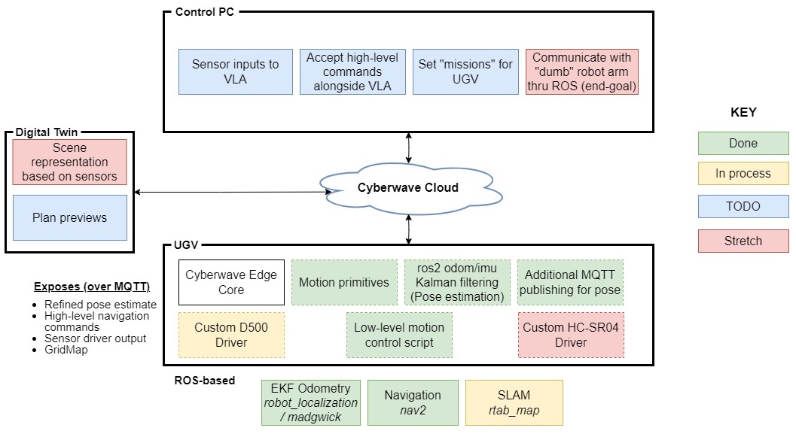

# Cyberwave Learning

Welcome to the **Cyberwave Learning** repository. This workspace contains a collection of tutorials, experiments, and configuration examples designed to help you integrate and extend the Cyberwave platform, specifically focusing on ROS 2 integration, sensor fusion, and Python-based digital twin interactions.

## 📂 Repository Structure

The repository is organized into several modules, each targeting a specific aspect of the Cyberwave ecosystem:

### 🎮 Tutorials & Experiments
- **[CameraStream](./CameraStream/)**: A Python tutorial demonstrating how to stream live camera feeds from a UGV digital twin using the Cyberwave API and OpenCV.
<!-- - **[Experiments](./Experiments/)**: Miscellaneous Python scripts for testing UGV movement and integrated webcam functionality.
  - `UGVMovement.py`: Basic movement control logic.
  - `IntegratedWebcam.py`: local camera integration tests. -->

### 🤖 ROS 2 & Robotics
- **[ROS2ContainerConnection](./ROS2ContainerConnection/)**: Configuration and Docker setup for establishing DDS connectivity between ROS 2 containers using FastDDS. This one is great to follow first, as you'll end up with a ros introspection tool you can call for running ros (but in a container)
- **[ExtendedKalmanFilter (EKF)](./ExtendedKalmanFilter/)**: A comprehensive guide for fusing Odometry, IMU, and Magnetometer data using the ROS 2 `robot_localization` package. This module includes:
  - Dockerized environment for EKF.
  - Calibration scripts for IMU and Magnetometer.
  - Demonstration of MQTT sidecar bridges for forwarding new topics (not necessarily following the original design pattern).
<!-- - **[dev_sam](./dev_sam/)**: Development workspace containing experimental Docker setups for:
  - `dros2`: Base ROS 2 environments.
  - `ekf`: Experimental EKF configurations.
  - `nav2`: Navigation 2 stack integration.
  - `rtab`: RTAB-Map SLAM configs. -->

### 🛠️ Drivers & Utilities
- **[ModifyingDriverInplace](./ModifyingDriverInplace/)**: Resources and backups for modifying Cyberwave edge drivers directly on the target hardware.

## 🚀 Getting Started

Most modules in this repository come with their own `README.md` and setup scripts. 

1. **Python API**: Ensure you have the `cyberwave-python` package installed in your Python environment.
2. **Docker**: ROS2 components are containerised.
3. **Hardware**: These tutorials are primarily tested with the **UGV Beast** platform.

## 🔗 Related Repositories
- **[cyberwave-python](https://github.com/cyberwave-os/cyberwave-python)**: The official Python SDK for Cyberwave.
- **[cyberwave-edge-ros-ugv](https://github.com/cyberwave-os/cyberwave-edge-ros-ugv)**: ROS 2 bridge and adapter for UGV edge devices.

---
## Progress

---
*Created for educational and demonstrative purposes at Politecnico di Milano.*
